# Laboratorio 5 - Automatización de síntesis de sumadores aproximados

**Curso:** Taller de Diseño Digital - EL3313  
**Semestre:** I Semestre 2026  
**Profesor:** Luis G. León-Vega, Ph.D.  

## Integrantes
- Gerson Adrian Cordero Zuñiga
- Nicole Irina Corrales Rodriguez
- Keilin Tatiana Loasiga Tellez

## Enlace al repositorio
https://github.com/keilinloaisiga8-lgtm/lab5-approximate-adders

---

## Descripción

En este laboratorio se desarrolló un flujo automatizado para trabajar con sumadores aproximados en Verilog dirigidos a la FPGA **xc7a100tcsg324-1 (Nexys A7)**. El proyecto incluye scripts para descargar los archivos fuente, copiarlos al directorio solicitado, sintetizarlos en Vivado, extraer información de los reportes y generar automáticamente un archivo `.csv` con los resultados.

## Objetivo

Automatizar el proceso de descarga, organización, síntesis y procesamiento de resultados de distintos diseños Verilog, reduciendo el trabajo manual y manteniendo un flujo ordenado y reproducible.

## Conceptos investigados

### 1. Descripción de hardware usando HDL, particularmente Verilog
Verilog es un lenguaje de descripción de hardware que permite modelar el comportamiento y la estructura de circuitos digitales. A diferencia de un lenguaje de programación tradicional, en Verilog se describen módulos, señales, entradas, salidas y lógica combinacional o secuencial, para luego sintetizar el diseño en hardware real como una FPGA.

### 2. Uso de scripting para automatizar la exploración del espacio de diseño y recolección de datos
El scripting permite automatizar tareas repetitivas dentro del flujo de diseño digital. En este laboratorio se usó para descargar archivos, organizar los diseños y ejecutar procesos de síntesis de forma sistemática, evitando hacerlo manualmente para cada archivo y facilitando la recolección ordenada de resultados.

### 3. Uso de scripting para procesar datos y sintetizar resultados
Además de automatizar la ejecución, los scripts permiten leer los reportes generados por las herramientas de síntesis, extraer información relevante y convertirla en resultados más fáciles de analizar. En este caso, se procesaron los archivos `.log` para obtener métricas como Slice LUTs y Slice Registers, y luego se consolidaron en un archivo `.csv`.

### 4. Uso de control de versiones en el proyecto
El control de versiones permite registrar cambios en el código, trabajar en equipo de manera ordenada y mantener un historial del desarrollo. En este proyecto se utilizó Git para organizar el trabajo en ramas, integrar avances de los scripts y conservar una versión estable final del repositorio.

## Estructura del proyecto

\`\`\`
.
├── README.md
├── fetch.sh
├── synth.sh
├── parse.sh
├── run_all.sh
├── results.csv
├── hdl/
└── reports/
\`\`\`

## Imágenes

> Las siguientes imágenes corresponden a una sesión de conversación con la IA Claude,
> utilizada como herramienta de apoyo durante el desarrollo del laboratorio. Con un grado de uso de 7, en una escala del 1 al 10.

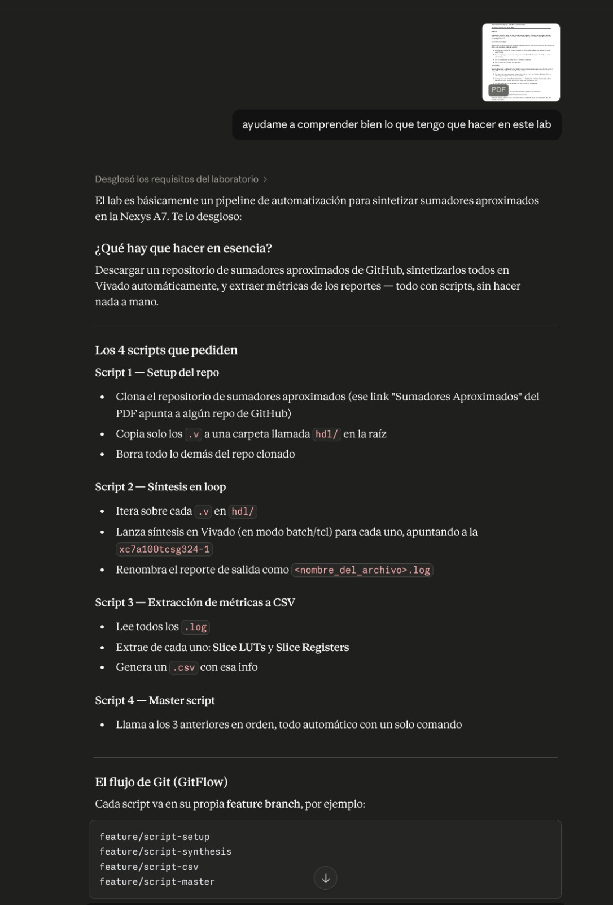
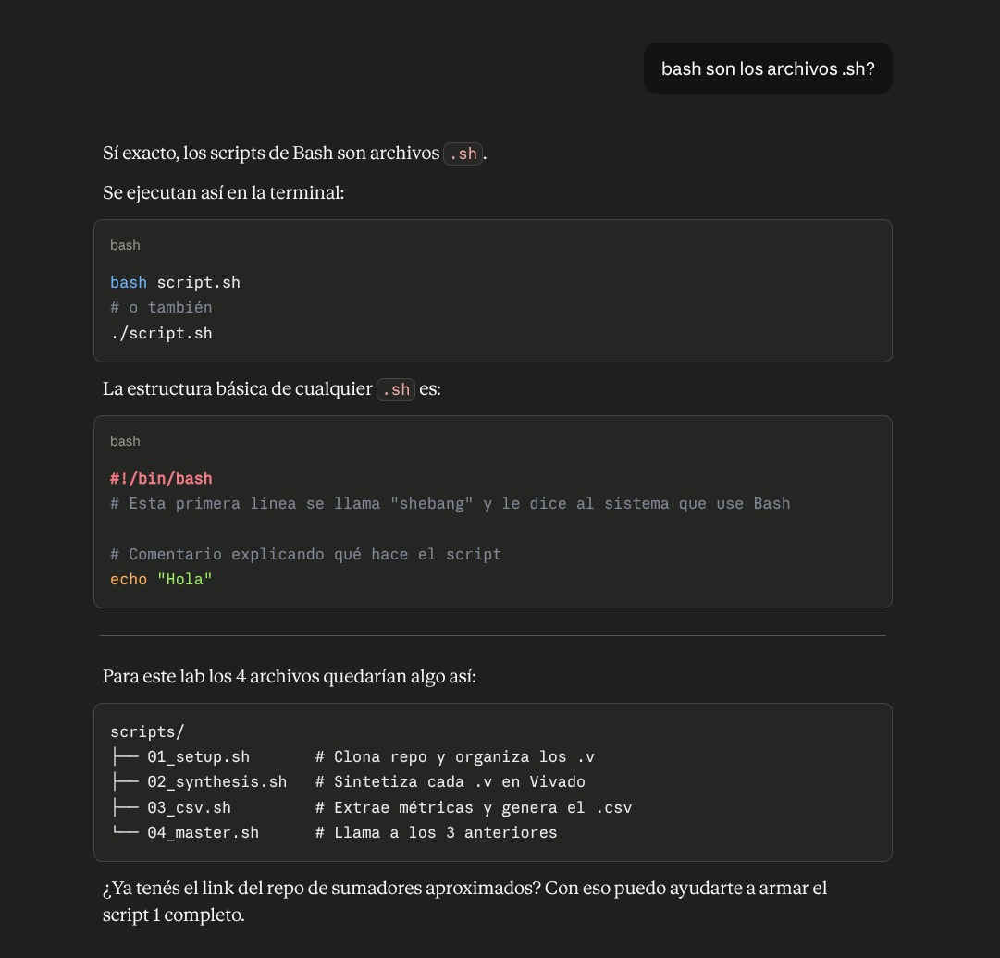
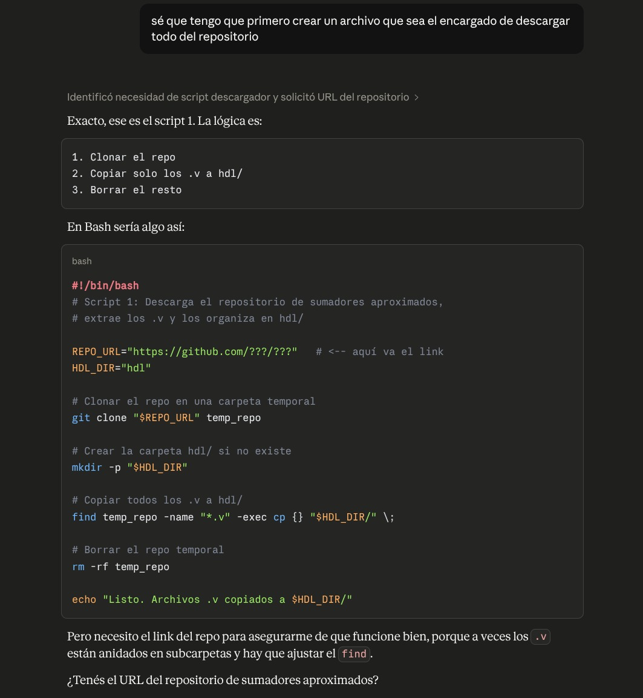
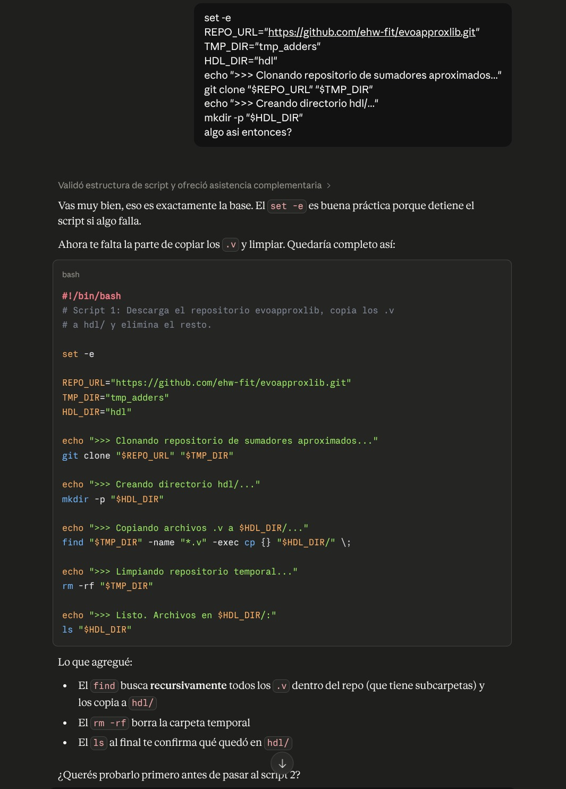
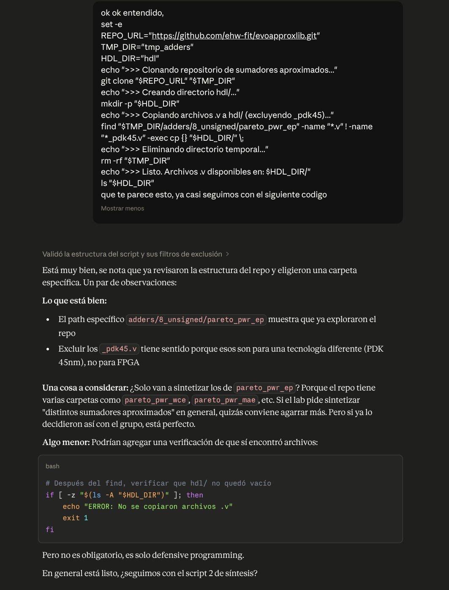
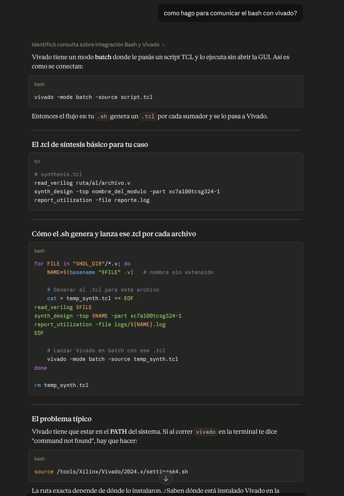
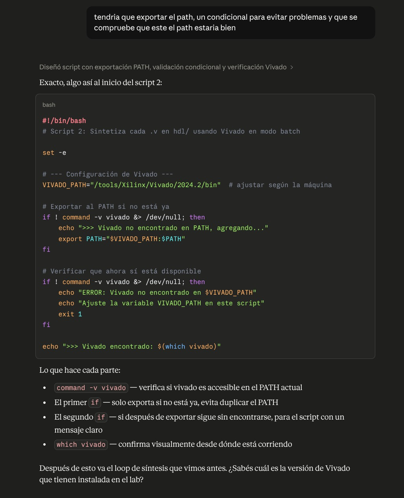
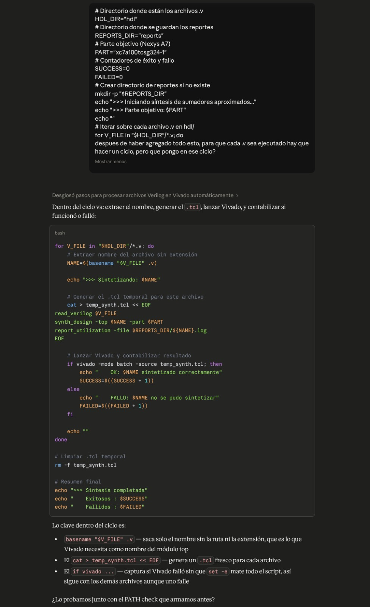
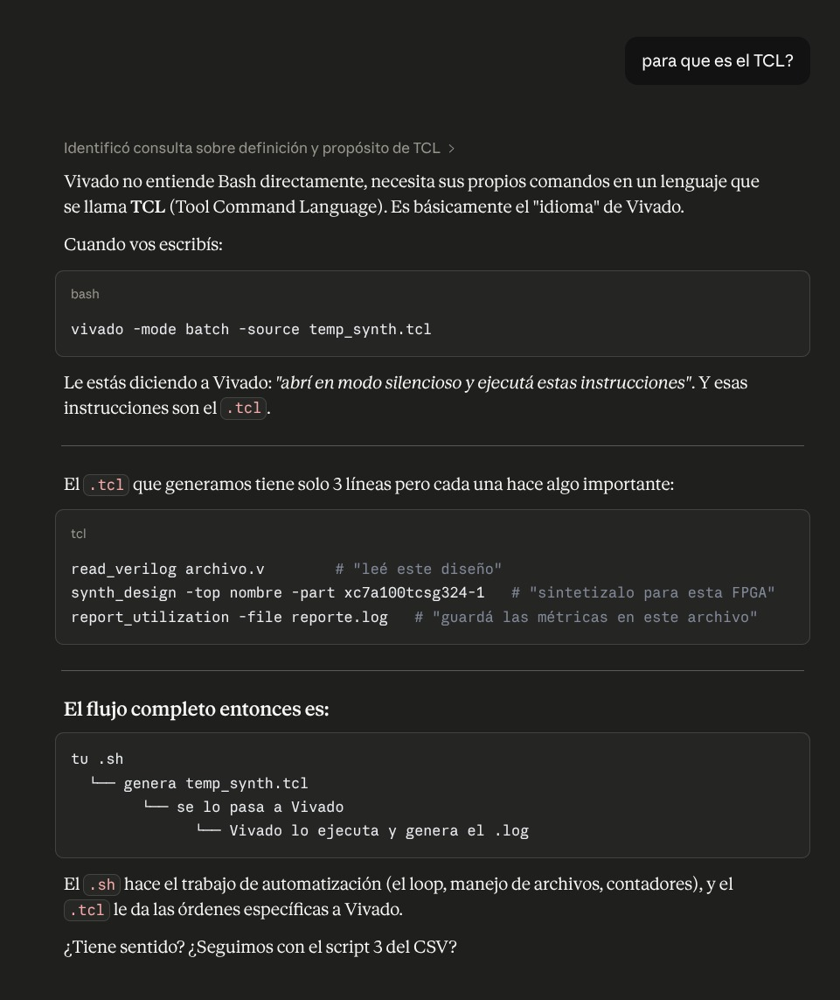
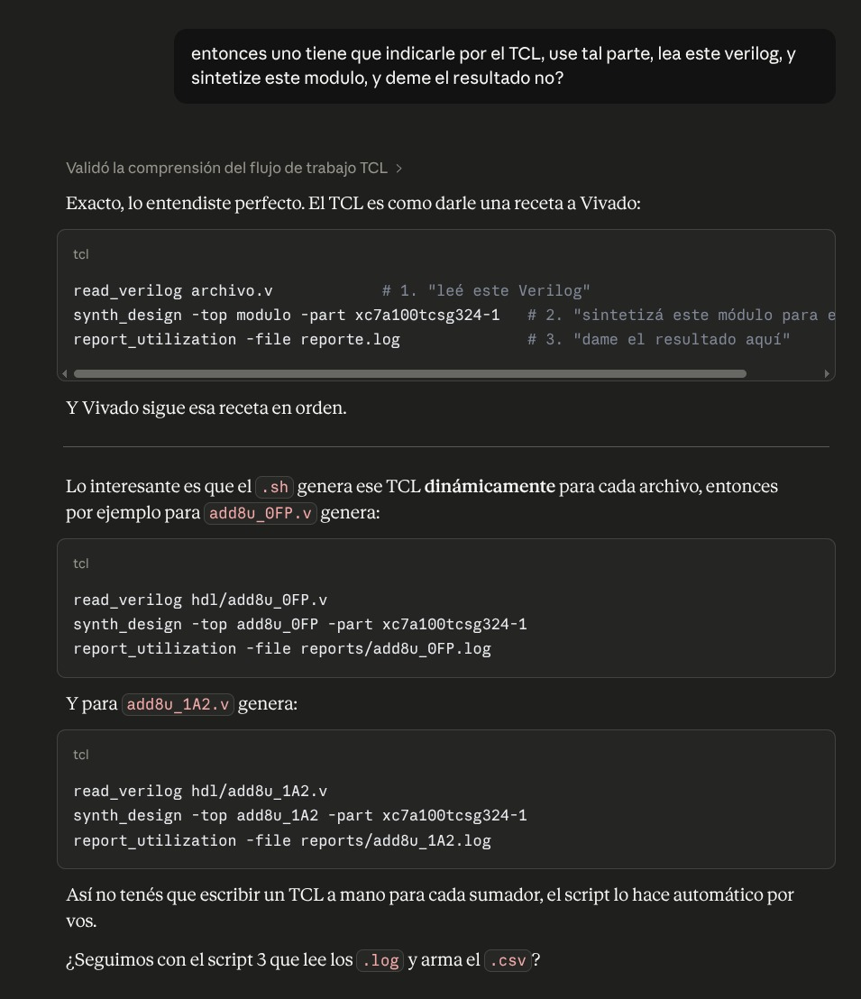
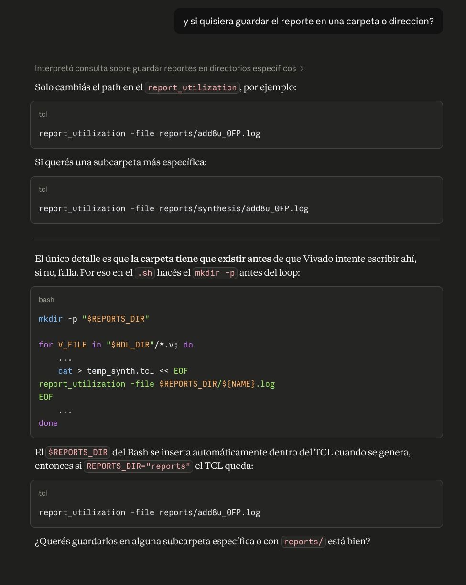
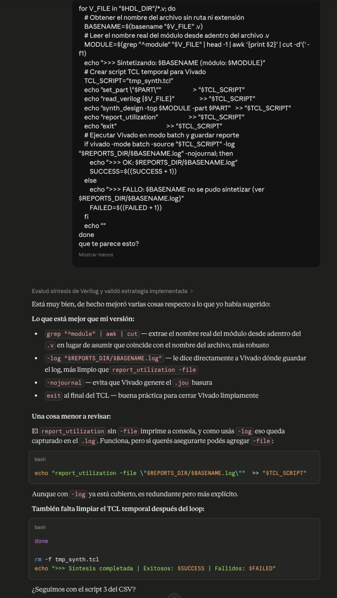
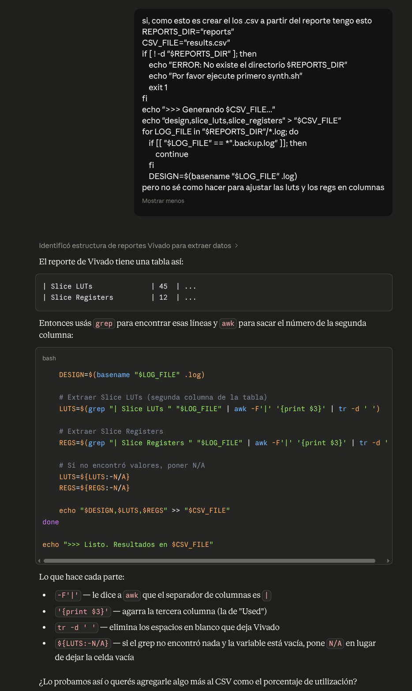
